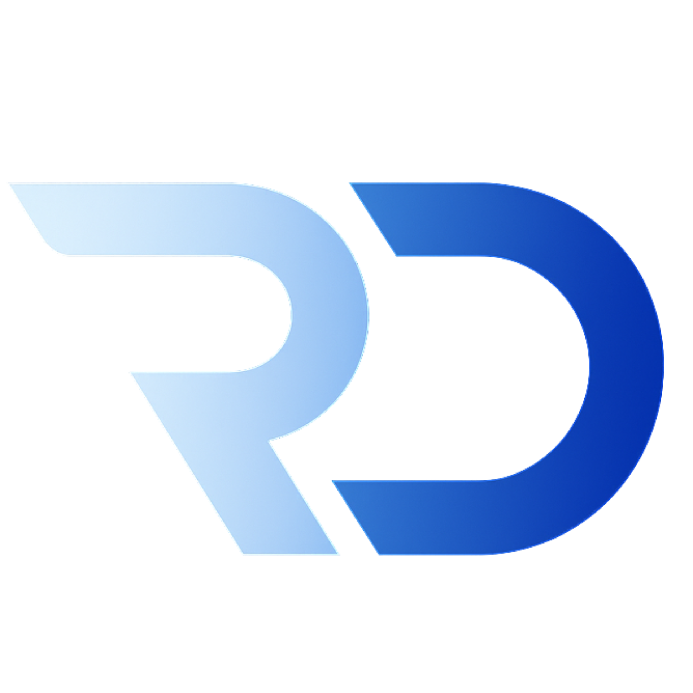

# Portfolio - Ronan Dela Cruz

  

## About This Project

This is my personal portfolio website showcasing my skills, projects, and experience as a developer. Built with modern web technologies, it features a clean, responsive design with smooth animations and an interactive user experience.

### 🤖 Featured: AI-Powered Chatbot

One of the standout features of this portfolio is an intelligent chatbot built with cutting-edge AI technologies:

- **Express.js Backend**: Robust server architecture
- **RAG (Retrieval-Augmented Generation)**: Enhanced AI responses with contextual information
- **LangChain**: Advanced AI framework for complex language processing
- **Pinecone**: Vector database for efficient semantic search and retrieval
- **Gemini LLM**: Google's powerful language model for natural conversations

The chatbot can answer questions about my experience, skills, and projects, providing visitors with an interactive way to learn more about my work.

## Tech Stack

## Core Technologies

- **React**: Frontend library for building the user interface
- **TypeScript**: Type-safe JavaScript for better development experience
- **Vite**: Fast build tool and development server

## Styling & UI

- **Tailwind CSS**: Utility-first CSS framework for styling
- **CSS Animations**: Custom animations for enhanced user experience
- **Devicon**: Icon library for technology logos

## Components & Features

- **Lucide React**: Lightweight icon library
- **Custom Hooks**: Including useTypewriter for text animation effects

## License

This project is licensed under the MIT License - see the [LICENSE](LICENSE) file for details.
